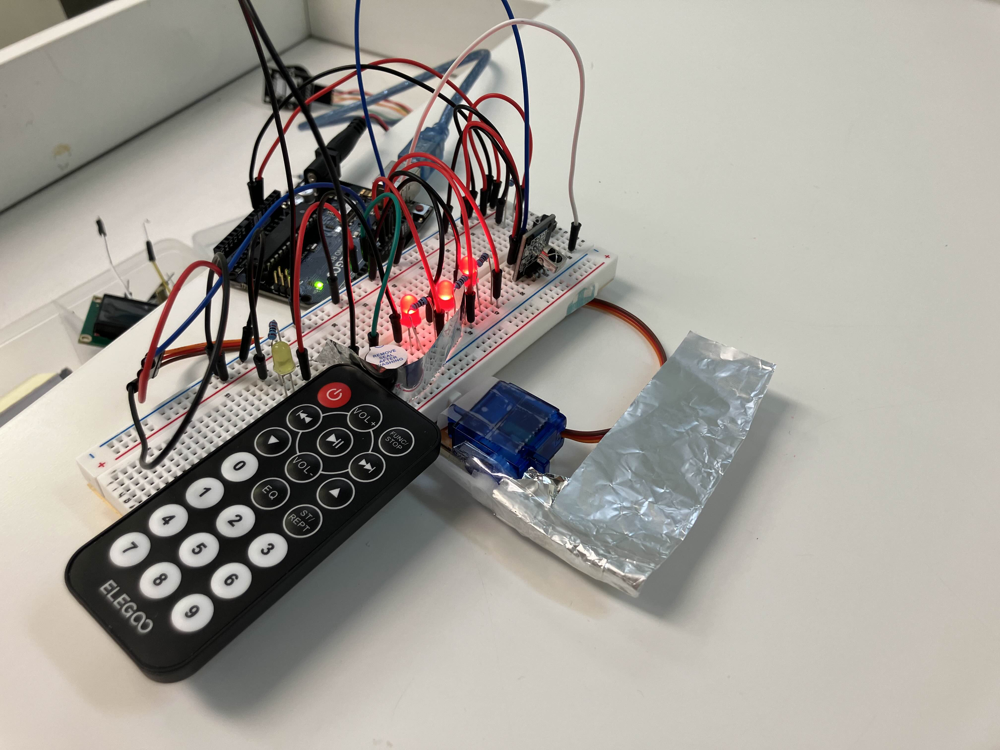

# Laser Tag - Arduino Multiplayer Game



## Overview

This project is a multiplayer laser tag game built using Arduino, utilizing the **IRremote** and **Servo** libraries. Players use IR remote modules to "shoot" infrared signals, and a servo-powered shield to receive and detect hits. The game is designed for fun, competitive play with multiple players.

### Made by Eason Chou

## Features

- **Multiplayer Gameplay:** Engage in laser tag battles with multiple players using Arduino-based systems.
- **Infrared Signal Detection:** Use IR remotes to shoot signals at opponents and register hits.
- **Servo-Powered Shield:** A servo motor rotates the signal receiver to deflect incoming shots.
- **Scoring System:** Track hits and determine the winner based on remaining hitpoints.

## Hardware Requirements

- Arduino (e.g., Uno, Mega)
- IR remote modules
- Servo motor
- IR receiver
- Breadboard and jumper wires
- Resistors and capacitors as needed
- Power supply

## Software Requirements

- PlatformIO extension on VSCode
- **IRremote** library
- **Servo** library

## Installation

1. **Clone the Repository:**
   ```bash
   git clone https://github.com/yourusername/laser-tag.git
   ```

2. **Install the Required Libraries:**
   - Open the Arduino IDE.
   - Go to **Sketch** > **Include Library** > **Manage Libraries...**
   - Search for and install the following libraries:
     - **IRremote**
     - **Servo**

3. **Upload the Code:**
   - Connect your Arduino to your computer.
   - Open the provided `.ino` file in the Arduino IDE.
   - Select the correct board and port.
   - Click the **Upload** button to upload the code to your Arduino.

## Usage

1. **Assemble the Hardware:**
   - Connect the IR remote module, IR receiver, and servo motor to the Arduino as specified in the code comments.
   - Power the setup and ensure all connections are secure.

2. **Start Playing:**
   - Power on the Arduino systems for each player.
   - Use the IR remotes to "shoot" at opponents.
   - The servo will rotate the shield to deflect incoming signals.
   - Registered hits will lower your health, shown by your red LEDs.

3. **Determine the Winner:**
   - The last player standing wins the game.

